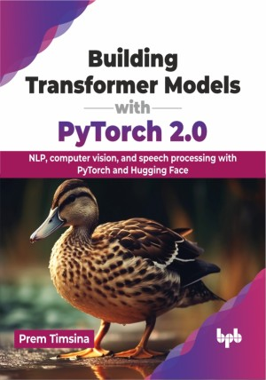

# Building Transformer Models with PyTorch 2.0

Your key to transformer based NLP, vision, speech, and multimodalities

This is the repository for [Building Transformer Models with PyTorch 2.0
](https://bpbonline.com/products/building-transformer-models-with-pytorch-2-0?_pos=1&_sid=1a44a1b38&_ss=r&variant=43297384005832),published by BPB Publications.

## About the Book
This book covers transformer architecture for various applications including NLP, computer vision, speech processing, and predictive modeling with tabular data. It is a valuable resource for anyone looking to harness the power of transformer architecture in their machine learning projects.

The book provides a step-by-step guide to building transformer models from scratch and fine-tuning pre-trained open-source models. It explores foundational model architecture, including GPT, VIT, Whisper, TabTransformer, Stable Diffusion, and the core principles for solving various problems with transformers. The book also covers transfer learning, model training, and fine-tuning, and discusses how to utilize recent models from Hugging Face. Additionally, the book explores advanced topics such as model benchmarking, multimodal learning, reinforcement learning, and deploying and serving transformer models.

In conclusion, this book offers a comprehensive and thorough guide to transformer models and their various applications.

## What You Will Learn
• Understand the core architecture of various foundational models, including single and multimodalities.

• Step-by-step approach to developing transformer-based Machine Learning models.

• Utilize various open-source models to solve your business problems.

• Train and fine-tune various open-source models using PyTorch 2.0 and the Hugging Face ecosystem.

• Deploy and serve transformer models.

• Best practices and guidelines for building transformer-based models.
